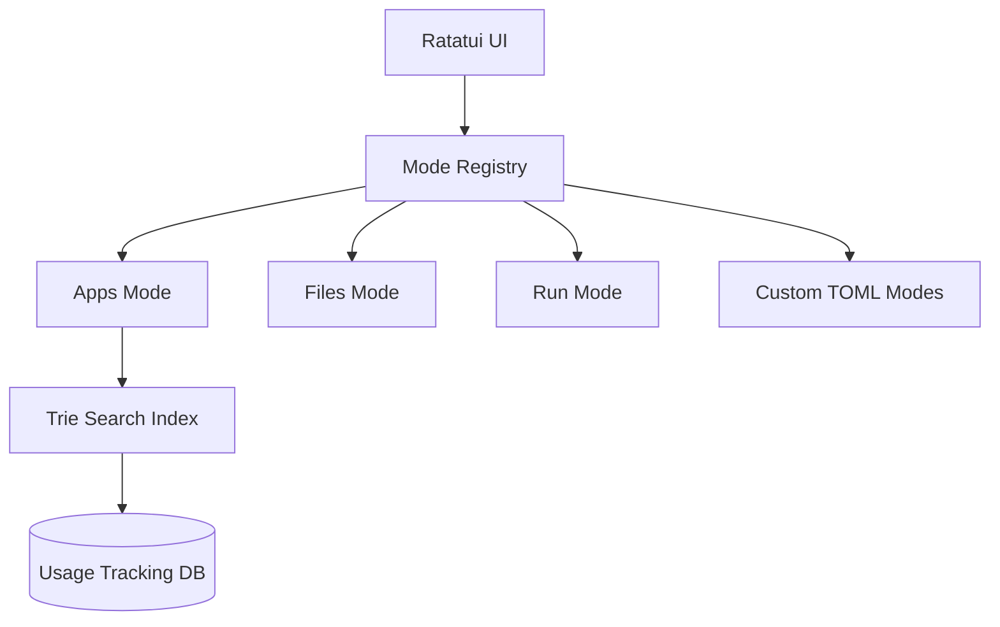

# LaTUI: The Advanced TUI Launcher

<p align="center">
  <b>A blazing-fast, modular, and extensible terminal-based launcher designed for Wayland environments.</b>
</p>

---

## Overview

**LaTUI** (Launcher TUI) is a high-performance alternative to traditional launchers like Rofi or Wofi. Written in Rust and built on top of the **Ratatui** framework, it provides a sleek, keyboard-centric interface for launching applications, searching files, and managing workflows with sub-50ms latency.

LaTUI is compositor-agnostic and focused on extreme performance, featuring a hybrid search engine that combines trie-based prefix filtering with Levenshtein-based typo tolerance.

## Key Features

- **Extreme Performance**: Sub-50ms startup time and <10ms search latency.
- **Hybrid Search Engine**:
    - **Trie-Based Filtering**: Efficient O(m) candidate reduction for large datasets.
    - **Damerau-Levenshtein**: Smart typo tolerance for fast, natural searching.
    - **Semantic Ranking**: Results weighted by name, keywords, categories, and descriptions.
- **Usage-Aware Ranking**: Frequency and recency-based boost (SQLite backend) that learns from your habits.
- **Plugin-Based Architecture**: Modular "Modes" for different tasks (Apps, Run, Files, Clipboard, Emojis).
- **Modern TUI**: Beautiful, responsive interface using Ratatui.
- **TOML-First Configuration**: Human-readable config files in `~/.config/latui/`.

---

## Architecture

LaTUI is designed for extensibility. Every functionality is a **Mode** that implements a common trait, allowing for isolated development and user-defined custom modes.



For more details, see the [Architecture Documentation](docs/architecture.md).

---

## Installation

### Arch Linux (AUR)
If you are on Arch, you can use `yay` or `paru`:
```bash
yay -S latui
```

---

## Configuration

LaTUI looks for configuration in `~/.config/latui/config.toml`.

**Example `config.toml`:**
```toml
[general]
default_mode = "apps"
theme = "dark"
max_results = 10

[keybindings]
switch_mode = "Tab"
next_item = "Down"
prev_item = "Up"
execute = "Enter"
cancel = "Esc"

[modes.apps]
enabled = true
cache_ttl = 3600
```

---

## Roadmap & Status

| Phase | Description | Status |
| :--- | :--- | :--- |
| **Phase 1** | Core search & Multi-field indexing | ✅ Done |
| **Phase 2** | Typo tolerance & Usage tracking | ✅ Done |
| **Phase 3** | Files & Run Modes | 🏗️ In Progress |
| **Phase 4** | Performance & Trie optimization | ✅ Done |
| **Phase 5** | UI Polish & Previews | 🗓️ Planned |

---

## License

This project is licensed under the **GPL-3.0-only** license. See the [LICENSE](LICENSE) file for details.

## Contributing

Contributions are welcome! Feel free to open issues or pull requests. Please ensure that all new features include appropriate tests in the `tests/` directory.
